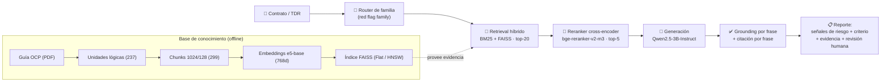
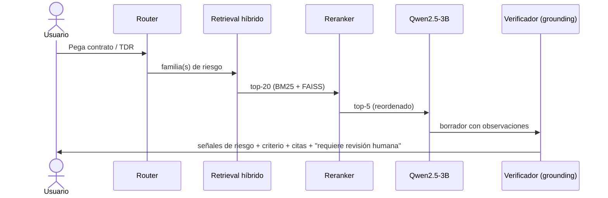

<!-- Coloca el logo de tu universidad en docs/assets/logo-universidad.png -->

# 🚩 RAG-Scanner de *Red Flags* en Contratación Pública
### Detección de patrones de riesgo en contratos del Estado mediante *Retrieval-Augmented Generation* avanzado con Qwen

**Proyecto Final — Maestría en Ciencia de Datos (Data Science)**
*Diseño e Implementación de un Sistema RAG en Google Colab*

| | |
|---|---|
| **Universidad** | Universidad Nacional de Ingeniería (UNI), Perú |
| **Unidad** | Unidad de Postgrado FIEECS |
| **Maestría** | Ciencia de Datos (Data Science) |
| **Curso** | IA Generativa I |
| **Docente** | PhD. Lucy Choque |
| **Autor** | Miguel Arias ([@MiguelAAR10](https://github.com/MiguelAAR10)) |
| **Fecha** | 31/05/2026 |
| **Repositorio** | https://github.com/MiguelAAR10/rag-redflags-colab |

<!-- (Opcional) foto del autor o del equipo: docs/assets/autor.png -->

---

## Resumen (Abstract)

Este proyecto diseña e implementa un sistema **RAG (Retrieval-Augmented Generation)** que funciona como un **escáner asistido de señales de riesgo** en documentos de contratación pública. A partir de la guía internacional **OCP — *Red Flags for Procurement*** (mapeada al estándar **OCDS**), el sistema indexa el conocimiento normativo, recupera los **indicadores de riesgo relevantes** ante un contrato/TDR, y genera **observaciones fundamentadas** con un modelo **Qwen2.5-3B-Instruct**, verificando que cada afirmación esté respaldada por la evidencia recuperada (*grounding*) y citando la fuente.

> [!IMPORTANT]
> El sistema **no determina corrupción ni emite acusaciones**. Detecta **patrones de riesgo bajo criterios definidos** (cada *red flag* es un indicador con definición y fórmula en la guía OCP) y **siempre requiere revisión humana**. La salida habla de *"señales de riesgo potenciales"*, no de *"sospechas"* ni *"fraude"*.

---

## 1. Problema y caso de uso

La contratación pública mueve una fracción enorme del gasto estatal y es uno de los procesos con mayor exposición a riesgos de integridad. Revisar manualmente expedientes, TDR y licitaciones es lento y heterogéneo. La pregunta del proyecto:

> **¿Puede un sistema RAG actuar como un "escáner" que, ante un contrato, señale qué *red flags* de una guía internacional aplican, con qué criterio y con qué evidencia — para priorizar revisión humana?**

**Por qué "criterios claros y sólidos, no sospechas":** cada *red flag* proviene de la guía OCP, que la define como un **indicador medible** del proceso (p. ej. *oferente único*, *plazo de presentación muy corto*, *adjudicación directa*), con su **fórmula** y **etapa OCDS**. El sistema ancla cada observación a uno de estos indicadores → la detección es **regla-fundamentada y trazable**, no subjetiva. [1]

---

## 2. ¿Qué es RAG y por qué aquí?

**RAG** combina un **recuperador** (busca pasajes relevantes en una base de conocimiento) con un **generador** (un LLM que responde *condicionado* a esos pasajes). Así el modelo responde con **conocimiento externo verificable** y se reduce la **alucinación**, en lugar de depender solo de su memoria paramétrica. [2]

> [!NOTE]
> **Concepto clave — Grounding:** una respuesta está *grounded* cuando cada afirmación puede rastrearse a un fragmento recuperado. Medimos el *grounding ratio* (frases soportadas / total) y **rechazamos** responder si no hay evidencia suficiente.

---

## 3. Dataset

- **Fuente:** guía **OCP 2024 — *Red Flags for Procurement*** (PDF, ~100 pp), mapeada a **OCDS**. Dominio: integridad en contratación pública. [1]
- **Definición operativa de "documento":** **unidad documental lógica** extraída del libro (cada indicador → bloques `core` / `formula` / `example`; metodología por subsección) — **no** un *chunk* arbitrario.
- **Resultado:** **237 unidades** con metadata (`indicator_code`, `indicator_name`, `family`, `stage`, `page`), → **299 chunks** (1024/128) para recuperación.
- **Familias de riesgo:** planeación · competencia/licitación · adjudicación · ejecución/contrato.
- **Dificultades:** layout a columnas, fórmulas en prosa, bilingüe EN/ES (resuelto con embeddings multilingües).

---

## 4. Arquitectura del sistema

**Modelos (HuggingFace):** `intfloat/multilingual-e5-base` (embeddings) · `BAAI/bge-reranker-v2-m3` (reranker) · `Qwen/Qwen2.5-3B-Instruct` (generación). [3][4][8]

---

## 5. Técnicas avanzadas de RAG empleadas

| Técnica | Qué aporta | Referencia |
|---|---|---|
| **Embeddings densos multilingües (E5)** | Representan el *significado* del texto en 768-d; capturan similitud semántica EN/ES. Prefijos `query:`/`passage:`. | [3] |
| **Vector search con FAISS** | Búsqueda eficiente de vecinos más cercanos; `IndexFlatIP` (exacto). | [5] |
| **HNSW (bonus)** | Grafo navegable para búsqueda **aproximada** O(log N); útil al escalar (ver §7.1). | [6] |
| **Hybrid Search (BM25 + FAISS)** | Combina señal **léxica** (BM25) y **semántica** (FAISS) vía *Reciprocal Rank Fusion*. | [7] |
| **Reranker cross-encoder** | Reordena el top-20 evaluando pares *(consulta, documento)* con mayor precisión → top-5. | [4][9] |
| **Grounding + citation-per-sentence** | Verifica soporte por frase y cita la fuente; reduce alucinación. | [2] |
| **Router por familia** | Clasifica la consulta y filtra/prioriza la recuperación por familia de *red flag*. | — |

> [!TIP]
> **Patrón *Retrieve & Re-Rank*:** primero se recuperan muchos candidatos de forma barata (bi-encoder/FAISS), luego un *cross-encoder* —más caro pero más preciso— reordena solo esos candidatos. Lo mejor de ambos mundos. [9]

---

## 6. Pipeline paso a paso

1. **Indexación (offline):** PDF → unidades → chunks → embeddings → FAISS.
2. **Router:** clasifica el contrato en familia(s) de *red flag*.
3. **Retrieval híbrido:** BM25 + FAISS (RRF) → top-20.
4. **Reranking:** cross-encoder → top-5.
5. **Generación:** Qwen redacta observaciones *condicionadas* a los 5 chunks.
6. **Grounding + citas:** se valida cada frase y se cita indicador/página.
7. **Salida segura:** señales de riesgo + criterio + evidencia + revisión humana.

---

## 7. Evaluación y análisis

- **Recuperación:** *Recall@k* / *Precision@k* sobre un *gold set* de 12 consultas con indicadores esperados.
- **Grounding ratio** sobre una muestra.
- **Comparación de métodos:** FAISS vs Híbrido vs (Híbrido + Reranker).
- **Análisis cualitativo:** ejemplo bueno (`Recall@5 = 1.0`) y malo (`0.5`, consulta con vocabulario distinto al de la guía) con interpretación honesta.

### 7.1 ¿Cuándo conviene HNSW? (benchmark honesto)

Con **N = 299** vectores, `IndexFlatIP` (exacto) ya es instantáneo, así que HNSW **no aporta velocidad** aquí. HNSW gana **al escalar** (búsqueda aproximada O(log N)). El notebook (celda 5.2) mide Flat vs HNSW a N = 299 / 5 000 / 50 000 para mostrar el punto de cruce — evitando afirmar una mejora que a esta escala no existe.

---

## 8. Minimización de alucinaciones

- **Prompt de sistema con lenguaje seguro** (nunca "corrupción"; sí "señal de riesgo potencial").
- **Grounding por frase**: marca cada frase como soportada/no soportada.
- **Refusal**: si ninguna frase tiene soporte → *"no hay evidencia suficiente"*.
- **Citación por frase**: cada observación apunta a su indicador OCP y página.

---

## 9. Demo interactiva (chatbot)

El notebook incluye un **chat (Gradio)** sobre `analyze()`: pegas un fragmento de contrato/TDR y obtienes señales de riesgo con criterios, evidencia, *grounding ratio* y la nota de revisión humana. (MiniMax queda como *segunda opinión* opcional; **Qwen es el generador principal**.)

---

## 10. Ética y límites

> [!WARNING]
> Esto es una **herramienta de priorización**, no un dictamen. No prueba corrupción; identifica **patrones que ameritan revisión**. Decisiones legales/administrativas requieren expediente completo y criterio humano. Las *red flags* son **proxies de riesgo**, no evidencia directa. [1]

---

## 11. Cómo ejecutar (Google Colab)

1. Abrir: `https://colab.research.google.com/github/MiguelAAR10/rag-redflags-colab/blob/main/notebooks/redflags_rag_colab.ipynb`
2. *Runtime → GPU (T4)* · añadir secret **`HF_TOKEN`**.
3. Subir el PDF de la guía OCP cuando lo pida.
4. *Run all.* Detalle en [`docs/COLAB.md`](docs/COLAB.md).

---

## 12. Limitaciones y trabajo futuro

- Corpus de ~100 pp (un PDF); `stage` inferido por heurística.
- **Futuro:** GraphRAG de entidades (proveedor/comprador) para *red flags* relacionales; sub-índices FAISS por familia; comparación Qwen 3B vs 7B; MiniMax como evaluador externo.

---

## Referencias

1. Open Contracting Partnership. *Red Flags for integrity / Red flags in public procurement: a guide to using data to detect and mitigate risks.* (2016, 2024).
2. Lewis, P. et al. *Retrieval-Augmented Generation for Knowledge-Intensive NLP Tasks.* NeurIPS 2020. arXiv:2005.11401.
3. Wang, L. et al. *Multilingual E5 Text Embeddings.* 2024. arXiv:2402.05672.
4. Chen, J. et al. *BGE-M3 / BGE reranker: Multi-Lingual, Multi-Functionality, Multi-Granularity Text Embeddings.* 2024. arXiv:2402.03216.
5. Johnson, J., Douze, M., Jégou, H. *Billion-scale similarity search with GPUs (FAISS).* IEEE Big Data 2019. arXiv:1702.08734.
6. Malkov, Yu. A., Yashunin, D. A. *Efficient and robust approximate nearest neighbor search using Hierarchical Navigable Small World graphs (HNSW).* IEEE TPAMI 2018. arXiv:1603.09320.
7. Robertson, S., Zaragoza, H. *The Probabilistic Relevance Framework: BM25 and Beyond.* Foundations and Trends in IR, 2009.
8. Qwen Team. *Qwen2.5 Technical Report.* 2024. arXiv:2412.15115.
9. Reimers, N., Gurevych, I. *Sentence-BERT.* EMNLP 2019. arXiv:1908.10084 · *Retrieve & Re-Rank* (sbert.net).

---

Metodología de desarrollo (nota): el repo se construyó por fases verificables con un arnés multi-CLI y un *gate* de tests por fase (`bash scripts/verify.sh`). Eso es **medio**, no el foco; el foco es el sistema RAG. Detalle en `docs/` (`MULTI_CLI_PROTOCOL.md`, `MEMORY_PROTOCOL.md`).
