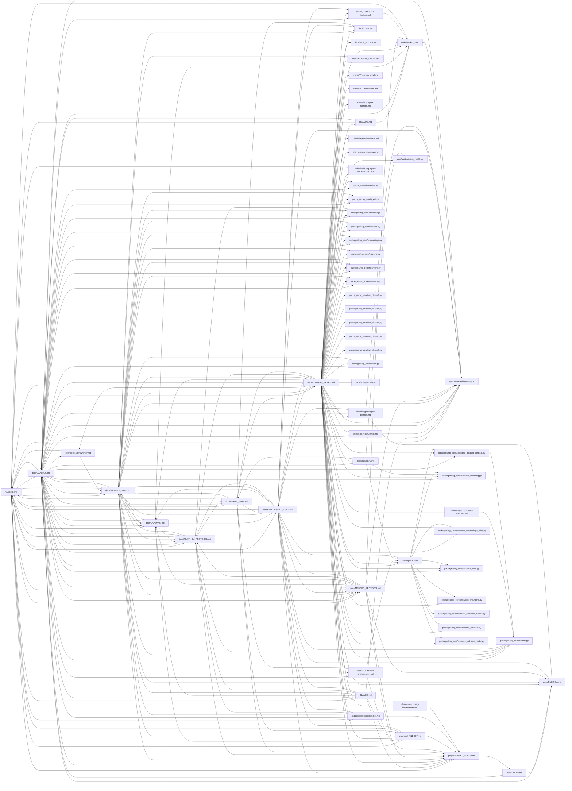

# CONTEXT_GRAPH (generado)

> Generado por `scripts/build_context_graph.py`. **No editar a mano.**
> Nodos: 61 · Aristas: 220 · Huérfanos: 0
> Regenerar: `bash scripts/build-context-graph.sh`

```mermaid
graph LR
  n_AGENTS_md["AGENTS.md"]
  n_CLAUDE_md["CLAUDE.md"]
  n_README_md["README.md"]
  n_docs_ARCHITECTURE_md["docs/ARCHITECTURE.md"]
  n_docs_CAVELOG_md["docs/CAVELOG.md"]
  n_docs_CAVEMAN_md["docs/CAVEMAN.md"]
  n_docs_COLAB_md["docs/COLAB.md"]
  n_docs_CONTEXT_GRAPH_md["docs/CONTEXT_GRAPH.md"]
  n_docs_LOOP_md["docs/LOOP.md"]
  n_docs_MCP_POLICY_md["docs/MCP_POLICY.md"]
  n_docs_MEMORY_INDEX_md["docs/MEMORY_INDEX.md"]
  n_docs_MEMORY_PROTOCOL_md["docs/MEMORY_PROTOCOL.md"]
  n_docs_MULTI_CLI_PROTOCOL_md["docs/MULTI_CLI_PROTOCOL.md"]
  n_docs_RUBRICA_md["docs/RUBRICA.md"]
  n_docs_SECURITY_MODEL_md["docs/SECURITY_MODEL.md"]
  n_docs_START_HERE_md["docs/START_HERE.md"]
  n_docs_TESTING_md["docs/TESTING.md"]
  n_specs_001_product_brief_md["specs/001-product-brief.md"]
  n_specs_002_mvp_scope_md["specs/002-mvp-scope.md"]
  n_specs_003_agent_runtime_md["specs/003-agent-runtime.md"]
  n_specs_004_redflags_rag_md["specs/004-redflags-rag.md"]
  n_specs_005_multicli_orchestration_md["specs/005-multicli-orchestration.md"]
  n_specs__TEMPLATE_feature_md["specs/_TEMPLATE-feature.md"]
  n_progress_CURRENT_STATE_md["progress/CURRENT_STATE.md"]
  n_progress_HANDOFF_md["progress/HANDOFF.md"]
  n_progress_NEXT_ACTION_md["progress/NEXT_ACTION.md"]
  n__claude_agents_coordinator_md[".claude/agents/coordinator.md"]
  n__claude_agents_dataset_engineer_md[".claude/agents/dataset-engineer.md"]
  n__claude_agents_evaluator_md[".claude/agents/evaluator.md"]
  n__claude_agents_rag_implementer_md[".claude/agents/rag-implementer.md"]
  n__claude_agents_reviewer_md[".claude/agents/reviewer.md"]
  n__claude_agents_spec_planner_md[".claude/agents/spec-planner.md"]
  n__opencode_agent_worker_md[".opencode/agent/worker.md"]
  n__codex_skills_rag_agentic_harness_SKILL_md[".codex/skills/rag-agentic-harness/SKILL.md"]
  n_tasks_backlog_json["tasks/backlog.json"]
  n_tasks_queue_json["tasks/queue.json"]
  n_packages_evals_metrics_py["packages/evals/metrics.py"]
  n_packages_rag_core_agent_py["packages/rag_core/agent.py"]
  n_packages_rag_core_chunkers_py["packages/rag_core/chunkers.py"]
  n_packages_rag_core_citations_py["packages/rag_core/citations.py"]
  n_packages_rag_core_embeddings_py["packages/rag_core/embeddings.py"]
  n_packages_rag_core_indexing_py["packages/rag_core/indexing.py"]
  n_packages_rag_core_loaders_py["packages/rag_core/loaders.py"]
  n_packages_rag_core_rerankers_py["packages/rag_core/rerankers.py"]
  n_packages_rag_core_retrievers_py["packages/rag_core/retrievers.py"]
  n_packages_rag_core_run_phase3_py["packages/rag_core/run_phase3.py"]
  n_packages_rag_core_run_phase4_py["packages/rag_core/run_phase4.py"]
  n_packages_rag_core_run_phase5_py["packages/rag_core/run_phase5.py"]
  n_packages_rag_core_run_phase6_py["packages/rag_core/run_phase6.py"]
  n_packages_rag_core_run_phase7_py["packages/rag_core/run_phase7.py"]
  n_packages_rag_core_tests_test_chunking_py["packages/rag_core/tests/test_chunking.py"]
  n_packages_rag_core_tests_test_dataset_contract_py["packages/rag_core/tests/test_dataset_contract.py"]
  n_packages_rag_core_tests_test_embeddings_faiss_py["packages/rag_core/tests/test_embeddings_faiss.py"]
  n_packages_rag_core_tests_test_eval_py["packages/rag_core/tests/test_eval.py"]
  n_packages_rag_core_tests_test_grounding_py["packages/rag_core/tests/test_grounding.py"]
  n_packages_rag_core_tests_test_notebook_smoke_py["packages/rag_core/tests/test_notebook_smoke.py"]
  n_packages_rag_core_tests_test_reranker_py["packages/rag_core/tests/test_reranker.py"]
  n_packages_rag_core_tests_test_retrieval_router_py["packages/rag_core/tests/test_retrieval_router.py"]
  n_packages_rag_core_verifier_py["packages/rag_core/verifier.py"]
  n_apps_api_app_main_py["apps/api/app/main.py"]
  n_apps_api_tests_test_health_py["apps/api/tests/test_health.py"]
  n_AGENTS_md --> n_docs_CAVELOG_md
  n_AGENTS_md --> n_docs_CAVEMAN_md
  n_AGENTS_md --> n_docs_MEMORY_INDEX_md
  n_AGENTS_md --> n_docs_MEMORY_PROTOCOL_md
  n_AGENTS_md --> n_docs_MULTI_CLI_PROTOCOL_md
  n_AGENTS_md --> n_docs_START_HERE_md
  n_AGENTS_md --> n_progress_CURRENT_STATE_md
  n_AGENTS_md --> n_progress_HANDOFF_md
  n_AGENTS_md --> n_progress_NEXT_ACTION_md
  n_AGENTS_md --> n_specs_004_redflags_rag_md
  n_CLAUDE_md --> n_AGENTS_md
  n_CLAUDE_md --> n_docs_CAVELOG_md
  n_CLAUDE_md --> n_docs_CAVEMAN_md
  n_CLAUDE_md --> n_docs_MEMORY_INDEX_md
  n_CLAUDE_md --> n_docs_MULTI_CLI_PROTOCOL_md
  n_CLAUDE_md --> n_progress_CURRENT_STATE_md
  n_CLAUDE_md --> n_progress_HANDOFF_md
  n_CLAUDE_md --> n_progress_NEXT_ACTION_md
  n_CLAUDE_md --> n_specs_004_redflags_rag_md
  n_README_md --> n_AGENTS_md
  n_README_md --> n_docs_CAVELOG_md
  n_README_md --> n_tasks_backlog_json
  n_docs_ARCHITECTURE_md --> n_specs_004_redflags_rag_md
  n_docs_CAVELOG_md --> n__opencode_agent_worker_md
  n_docs_CAVELOG_md --> n_AGENTS_md
  n_docs_CAVELOG_md --> n_docs_ARCHITECTURE_md
  n_docs_CAVELOG_md --> n_docs_CAVEMAN_md
  n_docs_CAVELOG_md --> n_docs_COLAB_md
  n_docs_CAVELOG_md --> n_docs_CONTEXT_GRAPH_md
  n_docs_CAVELOG_md --> n_docs_MEMORY_INDEX_md
  n_docs_CAVELOG_md --> n_docs_MEMORY_PROTOCOL_md
  n_docs_CAVELOG_md --> n_docs_MULTI_CLI_PROTOCOL_md
  n_docs_CAVELOG_md --> n_docs_RUBRICA_md
  n_docs_CAVELOG_md --> n_docs_START_HERE_md
  n_docs_CAVELOG_md --> n_docs_TESTING_md
  n_docs_CAVELOG_md --> n_packages_evals_metrics_py
  n_docs_CAVELOG_md --> n_packages_rag_core_agent_py
  n_docs_CAVELOG_md --> n_packages_rag_core_chunkers_py
  n_docs_CAVELOG_md --> n_packages_rag_core_citations_py
  n_docs_CAVELOG_md --> n_packages_rag_core_embeddings_py
  n_docs_CAVELOG_md --> n_packages_rag_core_indexing_py
  n_docs_CAVELOG_md --> n_packages_rag_core_loaders_py
  n_docs_CAVELOG_md --> n_packages_rag_core_rerankers_py
  n_docs_CAVELOG_md --> n_packages_rag_core_retrievers_py
  n_docs_CAVELOG_md --> n_packages_rag_core_tests_test_chunking_py
  n_docs_CAVELOG_md --> n_packages_rag_core_tests_test_dataset_contract_py
  n_docs_CAVELOG_md --> n_packages_rag_core_tests_test_embeddings_faiss_py
  n_docs_CAVELOG_md --> n_packages_rag_core_tests_test_eval_py
  n_docs_CAVELOG_md --> n_packages_rag_core_verifier_py
  n_docs_CAVELOG_md --> n_progress_NEXT_ACTION_md
  n_docs_CAVELOG_md --> n_specs_004_redflags_rag_md
  n_docs_CAVELOG_md --> n_specs_005_multicli_orchestration_md
  n_docs_CAVELOG_md --> n_specs__TEMPLATE_feature_md
  n_docs_CAVELOG_md --> n_tasks_backlog_json
  n_docs_CAVELOG_md --> n_tasks_queue_json
  n_docs_CAVEMAN_md --> n_docs_CAVELOG_md
  n_docs_CAVEMAN_md --> n_docs_MEMORY_INDEX_md
  n_docs_CAVEMAN_md --> n_docs_MULTI_CLI_PROTOCOL_md
  n_docs_CAVEMAN_md --> n_progress_CURRENT_STATE_md
  n_docs_CAVEMAN_md --> n_progress_HANDOFF_md
  n_docs_CAVEMAN_md --> n_tasks_backlog_json
  n_docs_COLAB_md --> n_docs_RUBRICA_md
  n_docs_CONTEXT_GRAPH_md --> n__claude_agents_coordinator_md
  n_docs_CONTEXT_GRAPH_md --> n__claude_agents_dataset_engineer_md
  n_docs_CONTEXT_GRAPH_md --> n__claude_agents_evaluator_md
  n_docs_CONTEXT_GRAPH_md --> n__claude_agents_rag_implementer_md
  n_docs_CONTEXT_GRAPH_md --> n__claude_agents_reviewer_md
  n_docs_CONTEXT_GRAPH_md --> n__claude_agents_spec_planner_md
  n_docs_CONTEXT_GRAPH_md --> n__codex_skills_rag_agentic_harness_SKILL_md
  n_docs_CONTEXT_GRAPH_md --> n__opencode_agent_worker_md
  n_docs_CONTEXT_GRAPH_md --> n_AGENTS_md
  n_docs_CONTEXT_GRAPH_md --> n_CLAUDE_md
  n_docs_CONTEXT_GRAPH_md --> n_README_md
  n_docs_CONTEXT_GRAPH_md --> n_apps_api_app_main_py
  n_docs_CONTEXT_GRAPH_md --> n_apps_api_tests_test_health_py
  n_docs_CONTEXT_GRAPH_md --> n_docs_ARCHITECTURE_md
  n_docs_CONTEXT_GRAPH_md --> n_docs_CAVELOG_md
  n_docs_CONTEXT_GRAPH_md --> n_docs_CAVEMAN_md
  n_docs_CONTEXT_GRAPH_md --> n_docs_LOOP_md
  n_docs_CONTEXT_GRAPH_md --> n_docs_MCP_POLICY_md
  n_docs_CONTEXT_GRAPH_md --> n_docs_MEMORY_INDEX_md
  n_docs_CONTEXT_GRAPH_md --> n_docs_MEMORY_PROTOCOL_md
  n_docs_CONTEXT_GRAPH_md --> n_docs_MULTI_CLI_PROTOCOL_md
  n_docs_CONTEXT_GRAPH_md --> n_docs_RUBRICA_md
  n_docs_CONTEXT_GRAPH_md --> n_docs_SECURITY_MODEL_md
  n_docs_CONTEXT_GRAPH_md --> n_docs_START_HERE_md
  n_docs_CONTEXT_GRAPH_md --> n_docs_TESTING_md
  n_docs_CONTEXT_GRAPH_md --> n_packages_evals_metrics_py
  n_docs_CONTEXT_GRAPH_md --> n_packages_rag_core_agent_py
  n_docs_CONTEXT_GRAPH_md --> n_packages_rag_core_chunkers_py
  n_docs_CONTEXT_GRAPH_md --> n_packages_rag_core_citations_py
  n_docs_CONTEXT_GRAPH_md --> n_packages_rag_core_embeddings_py
  n_docs_CONTEXT_GRAPH_md --> n_packages_rag_core_indexing_py
  n_docs_CONTEXT_GRAPH_md --> n_packages_rag_core_loaders_py
  n_docs_CONTEXT_GRAPH_md --> n_packages_rag_core_rerankers_py
  n_docs_CONTEXT_GRAPH_md --> n_packages_rag_core_retrievers_py
  n_docs_CONTEXT_GRAPH_md --> n_packages_rag_core_run_phase3_py
  n_docs_CONTEXT_GRAPH_md --> n_packages_rag_core_run_phase4_py
  n_docs_CONTEXT_GRAPH_md --> n_packages_rag_core_run_phase5_py
  n_docs_CONTEXT_GRAPH_md --> n_packages_rag_core_run_phase6_py
  n_docs_CONTEXT_GRAPH_md --> n_packages_rag_core_run_phase7_py
  n_docs_CONTEXT_GRAPH_md --> n_packages_rag_core_tests_test_chunking_py
  n_docs_CONTEXT_GRAPH_md --> n_packages_rag_core_tests_test_dataset_contract_py
  n_docs_CONTEXT_GRAPH_md --> n_packages_rag_core_tests_test_embeddings_faiss_py
  n_docs_CONTEXT_GRAPH_md --> n_packages_rag_core_tests_test_eval_py
  n_docs_CONTEXT_GRAPH_md --> n_packages_rag_core_tests_test_grounding_py
  n_docs_CONTEXT_GRAPH_md --> n_packages_rag_core_tests_test_reranker_py
  n_docs_CONTEXT_GRAPH_md --> n_packages_rag_core_tests_test_retrieval_router_py
  n_docs_CONTEXT_GRAPH_md --> n_packages_rag_core_verifier_py
  n_docs_CONTEXT_GRAPH_md --> n_progress_CURRENT_STATE_md
  n_docs_CONTEXT_GRAPH_md --> n_progress_HANDOFF_md
  n_docs_CONTEXT_GRAPH_md --> n_progress_NEXT_ACTION_md
  n_docs_CONTEXT_GRAPH_md --> n_specs_001_product_brief_md
  n_docs_CONTEXT_GRAPH_md --> n_specs_002_mvp_scope_md
  n_docs_CONTEXT_GRAPH_md --> n_specs_003_agent_runtime_md
  n_docs_CONTEXT_GRAPH_md --> n_specs_004_redflags_rag_md
  n_docs_CONTEXT_GRAPH_md --> n_specs_005_multicli_orchestration_md
  n_docs_CONTEXT_GRAPH_md --> n_specs__TEMPLATE_feature_md
  n_docs_CONTEXT_GRAPH_md --> n_tasks_backlog_json
  n_docs_CONTEXT_GRAPH_md --> n_tasks_queue_json
  n_docs_LOOP_md --> n_docs_START_HERE_md
  n_docs_MEMORY_INDEX_md --> n_AGENTS_md
  n_docs_MEMORY_INDEX_md --> n_docs_CAVELOG_md
  n_docs_MEMORY_INDEX_md --> n_docs_CAVEMAN_md
  n_docs_MEMORY_INDEX_md --> n_docs_CONTEXT_GRAPH_md
  n_docs_MEMORY_INDEX_md --> n_docs_LOOP_md
  n_docs_MEMORY_INDEX_md --> n_docs_MEMORY_PROTOCOL_md
  n_docs_MEMORY_INDEX_md --> n_docs_MULTI_CLI_PROTOCOL_md
  n_docs_MEMORY_INDEX_md --> n_docs_RUBRICA_md
  n_docs_MEMORY_INDEX_md --> n_docs_SECURITY_MODEL_md
  n_docs_MEMORY_INDEX_md --> n_packages_rag_core_agent_py
  n_docs_MEMORY_INDEX_md --> n_packages_rag_core_chunkers_py
  n_docs_MEMORY_INDEX_md --> n_packages_rag_core_citations_py
  n_docs_MEMORY_INDEX_md --> n_packages_rag_core_embeddings_py
  n_docs_MEMORY_INDEX_md --> n_packages_rag_core_indexing_py
  n_docs_MEMORY_INDEX_md --> n_packages_rag_core_loaders_py
  n_docs_MEMORY_INDEX_md --> n_packages_rag_core_rerankers_py
  n_docs_MEMORY_INDEX_md --> n_packages_rag_core_retrievers_py
  n_docs_MEMORY_INDEX_md --> n_packages_rag_core_verifier_py
  n_docs_MEMORY_INDEX_md --> n_progress_CURRENT_STATE_md
  n_docs_MEMORY_INDEX_md --> n_progress_HANDOFF_md
  n_docs_MEMORY_INDEX_md --> n_progress_NEXT_ACTION_md
  n_docs_MEMORY_INDEX_md --> n_specs_004_redflags_rag_md
  n_docs_MEMORY_PROTOCOL_md --> n_AGENTS_md
  n_docs_MEMORY_PROTOCOL_md --> n_docs_CAVELOG_md
  n_docs_MEMORY_PROTOCOL_md --> n_docs_CAVEMAN_md
  n_docs_MEMORY_PROTOCOL_md --> n_docs_CONTEXT_GRAPH_md
  n_docs_MEMORY_PROTOCOL_md --> n_docs_MEMORY_INDEX_md
  n_docs_MEMORY_PROTOCOL_md --> n_docs_MULTI_CLI_PROTOCOL_md
  n_docs_MEMORY_PROTOCOL_md --> n_docs_RUBRICA_md
  n_docs_MEMORY_PROTOCOL_md --> n_progress_CURRENT_STATE_md
  n_docs_MEMORY_PROTOCOL_md --> n_progress_HANDOFF_md
  n_docs_MEMORY_PROTOCOL_md --> n_progress_NEXT_ACTION_md
  n_docs_MEMORY_PROTOCOL_md --> n_specs_004_redflags_rag_md
  n_docs_MEMORY_PROTOCOL_md --> n_tasks_backlog_json
  n_docs_MULTI_CLI_PROTOCOL_md --> n_AGENTS_md
  n_docs_MULTI_CLI_PROTOCOL_md --> n_docs_CAVELOG_md
  n_docs_MULTI_CLI_PROTOCOL_md --> n_docs_MEMORY_INDEX_md
  n_docs_MULTI_CLI_PROTOCOL_md --> n_docs_START_HERE_md
  n_docs_MULTI_CLI_PROTOCOL_md --> n_packages_rag_core_chunkers_py
  n_docs_MULTI_CLI_PROTOCOL_md --> n_packages_rag_core_loaders_py
  n_docs_MULTI_CLI_PROTOCOL_md --> n_progress_NEXT_ACTION_md
  n_docs_START_HERE_md --> n_AGENTS_md
  n_docs_START_HERE_md --> n_docs_MEMORY_INDEX_md
  n_docs_START_HERE_md --> n_progress_CURRENT_STATE_md
  n_docs_START_HERE_md --> n_progress_HANDOFF_md
  n_docs_START_HERE_md --> n_progress_NEXT_ACTION_md
  n_docs_START_HERE_md --> n_specs_004_redflags_rag_md
  n_docs_TESTING_md --> n_apps_api_tests_test_health_py
  n_docs_TESTING_md --> n_docs_START_HERE_md
  n_docs_TESTING_md --> n_packages_rag_core_tests_test_chunking_py
  n_docs_TESTING_md --> n_tasks_queue_json
  n_specs_004_redflags_rag_md --> n_docs_CAVELOG_md
  n_specs_005_multicli_orchestration_md --> n_docs_START_HERE_md
  n_specs_005_multicli_orchestration_md --> n_progress_NEXT_ACTION_md
  n_specs_005_multicli_orchestration_md --> n_tasks_queue_json
  n_specs__TEMPLATE_feature_md --> n_tasks_backlog_json
  n_progress_CURRENT_STATE_md --> n_AGENTS_md
  n_progress_CURRENT_STATE_md --> n_docs_CAVEMAN_md
  n_progress_CURRENT_STATE_md --> n_docs_COLAB_md
  n_progress_CURRENT_STATE_md --> n_docs_CONTEXT_GRAPH_md
  n_progress_CURRENT_STATE_md --> n_docs_LOOP_md
  n_progress_CURRENT_STATE_md --> n_docs_MEMORY_INDEX_md
  n_progress_CURRENT_STATE_md --> n_docs_MEMORY_PROTOCOL_md
  n_progress_CURRENT_STATE_md --> n_docs_MULTI_CLI_PROTOCOL_md
  n_progress_CURRENT_STATE_md --> n_docs_RUBRICA_md
  n_progress_CURRENT_STATE_md --> n_packages_rag_core_loaders_py
  n_progress_CURRENT_STATE_md --> n_specs_004_redflags_rag_md
  n_progress_CURRENT_STATE_md --> n_specs__TEMPLATE_feature_md
  n_progress_CURRENT_STATE_md --> n_tasks_queue_json
  n_progress_HANDOFF_md --> n_AGENTS_md
  n_progress_HANDOFF_md --> n_progress_CURRENT_STATE_md
  n_progress_HANDOFF_md --> n_progress_NEXT_ACTION_md
  n_progress_NEXT_ACTION_md --> n_docs_COLAB_md
  n__claude_agents_coordinator_md --> n_AGENTS_md
  n__claude_agents_coordinator_md --> n_docs_CAVELOG_md
  n__claude_agents_coordinator_md --> n_docs_MEMORY_INDEX_md
  n__claude_agents_coordinator_md --> n_docs_MULTI_CLI_PROTOCOL_md
  n__claude_agents_coordinator_md --> n_progress_CURRENT_STATE_md
  n__claude_agents_coordinator_md --> n_progress_NEXT_ACTION_md
  n__claude_agents_dataset_engineer_md --> n_packages_rag_core_loaders_py
  n__claude_agents_rag_implementer_md --> n_progress_NEXT_ACTION_md
  n__claude_agents_spec_planner_md --> n_docs_CAVELOG_md
  n__claude_agents_spec_planner_md --> n_docs_RUBRICA_md
  n__claude_agents_spec_planner_md --> n_progress_CURRENT_STATE_md
  n__claude_agents_spec_planner_md --> n_specs_004_redflags_rag_md
  n__opencode_agent_worker_md --> n_AGENTS_md
  n__opencode_agent_worker_md --> n_docs_MEMORY_INDEX_md
  n__codex_skills_rag_agentic_harness_SKILL_md --> n_AGENTS_md
  n_tasks_backlog_json --> n_AGENTS_md
  n_tasks_backlog_json --> n_specs_004_redflags_rag_md
  n_tasks_queue_json --> n_packages_rag_core_tests_test_chunking_py
  n_tasks_queue_json --> n_packages_rag_core_tests_test_dataset_contract_py
  n_tasks_queue_json --> n_packages_rag_core_tests_test_embeddings_faiss_py
  n_tasks_queue_json --> n_packages_rag_core_tests_test_eval_py
  n_tasks_queue_json --> n_packages_rag_core_tests_test_grounding_py
  n_tasks_queue_json --> n_packages_rag_core_tests_test_notebook_smoke_py
  n_tasks_queue_json --> n_packages_rag_core_tests_test_reranker_py
  n_tasks_queue_json --> n_packages_rag_core_tests_test_retrieval_router_py
  n_packages_rag_core_tests_test_dataset_contract_py --> n_packages_rag_core_loaders_py
```
