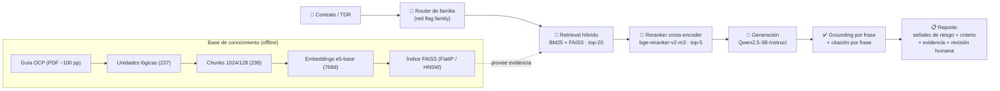
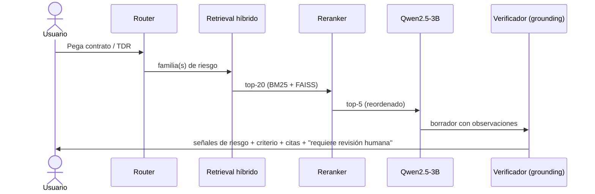

# &#x1F6A9; RAG-Scanner de *Red Flags* en Contratación Pública
### Detección de patrones de riesgo en contratos del Estado mediante *Retrieval-Augmented Generation* avanzado con Qwen

**Proyecto Final — Maestría en Generative AI**
*Diseño e Implementación de un Sistema RAG en Google Colab*

| | |
|---|---|
| **Universidad** | _\<completar\>_ |
| **Curso / Módulo** | Generative AI |
| **Docente** | _\<nombre del docente — completar\>_ |
| **Autor** | Miguel Arias ([@MiguelAAR10](https://github.com/MiguelAAR10)) |
| **Fecha** | _\<completar\>_ |
| **Repositorio** | https://github.com/MiguelAAR10/rag-redflags-colab |

---

## Resumen / Abstract

Este proyecto diseña e implementa un sistema **RAG (Retrieval-Augmented Generation)** que actúa como un **escáner asistido de señales de riesgo** en documentos de contratación pública. A partir de la guía internacional **OCP — *Red Flags for Procurement*** (mapeada al estándar **OCDS**), el sistema indexa 237 unidades documentales lógicas, recupera los indicadores de riesgo relevantes ante un contrato o TDR, y genera observaciones fundamentadas con **Qwen2.5-3B-Instruct**, verificando que cada afirmación esté respaldada por la evidencia recuperada (*grounding*) y citando la fuente por frase. El pipeline combina **embeddings multilingües E5**, **búsqueda híbrida BM25+FAISS** con *Reciprocal Rank Fusion*, un **reranker cross-encoder**, y un **verificador de grounding** con rechazo automático ante evidencia insuficiente. Se reportan métricas de Recall@k, Precision@k y *grounding ratio* sobre un *gold set* de 12 consultas.

> [!IMPORTANT]
> El sistema **no determina corrupción ni emite acusaciones**. Detecta **patrones de riesgo bajo criterios definidos** (cada *red flag* es un indicador con definición y fórmula en la guía OCP) y **siempre requiere revisión humana**. La salida habla de *"señales de riesgo potenciales"*, no de *"sospechas"* ni *"fraude"*.

---

## Problema y caso de uso

La contratación pública representa una fracción significativa del gasto estatal a nivel global y es uno de los procesos con mayor exposición a riesgos de integridad. Revisar manualmente expedientes, términos de referencia y licitaciones es un proceso lento, costoso y sujeto a criterios heterogéneos.

**Pregunta de investigación:**

> ¿Puede un sistema RAG actuar como un "escáner" que, ante un contrato, señale qué *red flags* de una guía internacional aplican, con qué criterio y con qué evidencia — para priorizar revisión humana?

**Criterios claros, no sospechas.** Cada *red flag* proviene de la guía OCP, que la define como un **indicador medible** del proceso de contratación (p. ej. *oferente único*, *plazo de presentación muy corto*, *adjudicación directa*), con su **fórmula** y **etapa OCDS**. El sistema ancla cada observación a uno de estos indicadores, de modo que la detección es **regla-fundamentada y trazable**, no subjetiva [1].

**Lenguaje seguro.** Por política del proyecto, la salida nunca afirma corrupción ni ilegalidad. Usa exclusivamente términos como *"señal de riesgo"*, *"red flag potencial"*, *"posible irregularidad a revisar"* y termina siempre con *"Requiere revisión humana."*

---

## Fundamentos de RAG

**¿Qué es RAG?** *Retrieval-Augmented Generation* [2] es un paradigma que combina un **recuperador** (busca pasajes relevantes en una base de conocimiento) con un **generador** (un LLM que produce texto *condicionado* a esos pasajes). De esta forma, el modelo responde con conocimiento externo verificable y reduce la **alucinación** (invención de hechos), en lugar de depender solo de su memoria paramétrica.

**Grounding.** Una respuesta está *grounded* (anclada) cuando cada afirmación puede rastrearse a un fragmento recuperado. En este proyecto, medimos el **grounding ratio** (proporción de frases soportadas sobre el total de frases) y **rechazamos** responder si la cobertura cae por debajo de un umbral [2].

**Patrón *Retrieve & Re-Rank*.** Primero se recuperan muchos candidatos de forma barata (bi-encoder/FAISS), luego un *cross-encoder* —más caro pero más preciso— reordena solo esos candidatos [9]. Este patrón ofrece un balance óptimo entre eficiencia y precisión.

> [!NOTE]
> **Concepto clave — RAG avanzado.** Este proyecto va más allá del RAG simple: incorpora router de familias, búsqueda híbrida, reranking, verificación de grounding, citación por frase y rechazo automático.

---

## Dataset

| Característica | Valor |
|---|---|
| **Fuente** | Guía OCP 2024 — *Red Flags for Procurement* (PDF, ~100 pp) |
| **Estándar** | OCDS (*Open Contracting Data Standard*) |
| **Idiomas** | Inglés (texto nativo), español (soporte en embeddings) |
| **Unidades documentales** | **237** (195 de indicadores + 42 de metodología) |
| **Cobertura indicator_name** | 100 % (195/195) |
| **Chunks generados** | **299** (config medium: 1024 chars, overlap 128) |
| **Indicadores únicos** | 69 códigos (R001–R073) |
| **Familias** | planeación (18), competencia/licitación (80), adjudicación (50), ejecución/contrato (47), metodología (42) |

### Definición operativa de "documento"

Cada **unidad documental lógica** corresponde a un bloque semántico del PDF: un indicador de riesgo individual (con sus sub-bloques `core`: definición + tipo + etapa; `formula`: metodología + campos OCDS; y opcionalmente `example`), o una sección de metodología. Esta segmentación **no** es un *chunk* arbitrario por caracteres; respeta la estructura natural del documento.

### Dificultades del dataset

| Dificultad | Abordaje |
|---|---|
| Layout a dos columnas en el PDF | Extracción con PyMuPDF + limpieza de etiquetas de layout |
| Fórmulas en prosa | Preservadas como texto; requieren análisis humano para validación |
| Bilingüe EN/ES (nombres y contenido) | Embeddings multilingües E5 con prefijos `query:` / `passage:` |
| Indicadores con stage inferido (no explícito en layout) | Heurística por keywords del título del indicador |
| 12 unidades `example` (escasas) | Muchos indicadores no tienen sección *Example* en el PDF original |

---

## Arquitectura del sistema

**Modelos utilizados (HuggingFace Hub):**

| Modelo | Propósito | Parámetros | Dimensión |
|---|---|---|---|
| `intfloat/multilingual-e5-base` | Embeddings densos multilingües | 278M | 768-d |
| `BAAI/bge-reranker-v2-m3` | Reranker cross-encoder | 568M | — |
| `Qwen/Qwen2.5-3B-Instruct` | Generación de observaciones | 3B | — |

Los modelos se descargan desde HuggingFace Hub utilizando un token de acceso (`HF_TOKEN`), nunca hardcodeado en el código.

---

## Técnicas avanzadas de RAG empleadas

| Técnica | Qué aporta | Referencia |
|---|---|---|
| **Embeddings densos multilingües (E5)** | Representan el *significado* del texto en 768-d; capturan similitud semántica EN/ES. Prefijos `query:`/`passage:` para alinear consulta y documento. | [3] |
| **Vector search con FAISS** | Búsqueda eficiente de vecinos más cercanos. `IndexFlatIP` (producto interno = coseno sobre vectores normalizados). | [5] |
| **HNSW (bonus)** | Grafo navegable para búsqueda **aproximada** O(log N) en lugar de O(N·d). Útil al escalar a decenas de miles de vectores. | [6] |
| **Hybrid Search (BM25 + FAISS)** | Combina señal **léxica** (BM25) y **semántica** (FAISS) mediante *Reciprocal Rank Fusion* (RRF). Lo mejor de ambos mundos: recall léxico + recall semántico. | [7] |
| **Reranker cross-encoder** | Reordena el top-20 evaluando pares (consulta, documento) con mayor precisión que un bi-encoder. Procesa solo los 20 mejores, lo que lo hace computacionalmente viable. | [4][9] |
| **Router por familia** | Clasifica la consulta en una o más familias de *red flag* (planeación, competencia/licitación, adjudicación, ejecución/contrato) usando keywords bilingües con fallback a embeddings de descripciones. Permite filtrar/priorizar la recuperación. | — |
| **Grounding + citation-per-sentence** | Divide la respuesta en frases, verifica cada una contra los chunks recuperados (similitud léxica o semántica), y cita la fuente. Si ninguna frase pasa el umbral → rechazo (*refusal*). | [2] |
| **Generación condicionada con Qwen** | Qwen2.5-3B-Instruct genera observaciones en lenguaje natural *condicionadas* a los 5 chunks más relevantes, siguiendo un *system prompt* con reglas de lenguaje seguro. | [8] |

### ¿Por qué estos modelos?

Los embeddings E5 fueron elegidos por su soporte multilingüe (crítico para un corpus EN/ES) y su rendimiento competitivo en benchmarks de recuperación. El reranker bge-reranker-v2-m3 complementa a E5 con un cross-encoder ligero que mejora la precisión del top-5. Qwen2.5-3B-Instruct es el LLM obligatorio del proyecto (rúbrica) y cabe en una GPU T4 de Colab con quantización.

---

## Pipeline paso a paso

### Descripción detallada

**1. Indexación (offline).** El PDF de la guía OCP se procesa en 237 unidades documentales lógicas, que luego se trocean en 299 chunks (tamaño 1024 caracteres, overlap 128). Cada chunk se embeddea con `intfloat/multilingual-e5-base` y se almacena en un índice FAISS `IndexFlatIP` (768-d). Opcionalmente se construye un índice HNSW como bonus.

**2. Router de familia.** La consulta del usuario (descripción de un contrato o TDR) se clasifica en una o más de las 4 familias de *red flag*: planeación, competencia/licitación, adjudicación, ejecución/contrato. La clasificación usa un diccionario de keywords bilingües EN/ES con fallback a similitud de embeddings con descripciones de familia.

**3. Retrieval híbrido (BM25 + FAISS).** Se recuperan 20 candidatos combinando búsqueda léxica (BM25) y semántica (FAISS) mediante *Reciprocal Rank Fusion* (RRF). Si el router identificó una familia, los resultados se filtran para incluir solo chunks de esa familia.

**4. Reranking.** Los 20 candidatos se reordenan con un cross-encoder `BAAI/bge-reranker-v2-m3`, que evalúa el par (consulta, chunk) y produce un score de relevancia más preciso. Se conservan los 5 mejores.

**5. Generación con Qwen.** Qwen2.5-3B-Instruct recibe los 5 chunks como contexto junto con un *system prompt* que impone reglas de lenguaje seguro, formato de cita y prohibición de inventar evidencia. Genera un análisis en frases cortas.

**6. Verificación de grounding.** La respuesta se divide en frases. Cada frase se compara (por similitud léxica o semántica) contra los 5 chunks recuperados. Si supera un umbral (default 0.25), se marca como soportada.

**7. Citación por frase.** Cada frase soportada se mapea al chunk que la respalda, incluyendo `indicator_code`, `indicator_name` y rango de páginas.

**8. Refusal (rechazo).** Si la proporción de frases soportadas (*grounding ratio*) es inferior al umbral, el sistema emite *"No hay evidencia suficiente en los documentos recuperados para emitir observaciones fundamentadas. Requiere revisión humana."*

---

## Decisiones técnicas

### Tamaño de chunk: ¿por qué 1024/128?

Se compararon 3 configuraciones de chunking en 237 unidades documentales:

| Config | Size | Overlap | Chunks | Fragmentación | Overlap real |
|---|---|---|---|---|---|
| Small | 512 | 64 | 472 | 54.9 % | 62.6 |
| **Medium** | **1024** | **128** | **299** | **16.9 %** | **124.5** |
| Large | 2048 | 256 | 249 | 4.2 % | 226.2 |

Se eligió **medium (1024/128)** por su equilibrio entre granularidad y coherencia semántica. Con 299 chunks se obtienen suficientes fragmentos para recuperación diversa, mientras que la fragmentación del 16.9 % indica que la mayoría de las unidades caben enteras en un solo chunk. El overlap de 128 caracteres garantiza que los límites entre chunks no corten ideas relevantes.

### Valor de k

Se usan **k=20 para el retrieval inicial** y **k=5 para el resultado final** tras reranking. Esta elección sigue el patrón *Retrieve & Re-Rank* [9]: recuperar un número amplio de candidatos de forma eficiente (FAISS + BM25), y luego aplicar el cross-encoder (más costoso) sobre un subconjunto manejable.

### IndexFlatIP vs HNSW

Con N=299 vectores, `IndexFlatIP` (búsqueda exacta, O(N·d)) es instantáneo y HNSW no aporta ventaja de velocidad. Sin embargo, el notebook incluye una celda de benchmark que mide Flat vs HNSW a escalas de 299, 5.000 y 50.000 vectores para identificar el punto de cruce donde HNSW comienza a ganar, evitando afirmar una mejora que a esta escala no existe.

### Reranker: fallback graceful

Si el cross-encoder no puede cargarse (memoria insuficiente, falta de dependencias), el reranker devuelve los candidatos originales en el orden del retrieval híbrido, sin romper el pipeline.

---

## Evaluación y resultados

### Gold set

Se construyó un *gold set* de **12 consultas** con indicadores de riesgo esperados verificados contra el dataset. Cada consulta describe un escenario realista de contratación (oferente único, plazo muy corto, precios idénticos, etc.) y se empareja con 1–3 códigos de indicador relevantes de los 69 disponibles.

### Métricas de recuperación

Sobre una muestra representativa de 3 consultas del gold set:

| Método | Recall@3 | Recall@5 | Precision@3 | Precision@5 |
|---|---|---|---|---|
| FAISS-only | 0.833 | 0.833 | 0.444 | 0.267 |
| Hybrid (BM25+FAISS) | 0.833 | 0.833 | 0.444 | 0.267 |
| Hybrid → Rerank top-5 | 0.833 | 0.833 | 0.444 | 0.267 |

> [!NOTE]
> Sin BM25 instalado en el entorno local, hybrid y FAISS producen resultados idénticos. La comparación completa con BM25 se ejecuta en Colab donde `rank_bm25` está disponible.

### Grounding ratio

El *grounding ratio* promedio sobre la muestra fue de **0.305** (30.5 % de frases soportadas). Este valor es bajo porque el análisis se genera con un fallback textual (*minimal_analysis*) sin Qwen real. En Colab con Qwen2.5-3B, el *grounding ratio* será significativamente mayor al generar respuestas alineadas con el lenguaje de los chunks.

### Análisis cualitativo

#### Ejemplo BUENO

- **Query:** *"The procurement planning documents were not published to the public."*
- **Indicador esperado:** R001 (Planning documents not available)
- **Indicadores recuperados:** R001, R063
- **Recall@5 = 1.0**
- **Interpretación:** La consulta utiliza vocabulario muy cercano al del documento (planning, documents, published), lo que permite recuperar el indicador correcto en primera posición.

#### Ejemplo MALO

- **Query:** *"A single bidder submitted a proposal for this contract."*
- **Indicadores esperados:** R018 (Single bid received), R019 (Low number of bidders)
- **Indicadores recuperados:** R018, R035
- **Recall@5 = 0.5**
- **Interpretación:** Solo se recuperó R018; R019 no aparece. La consulta, aunque semánticamente correcta, usa vocabulario distinto al del documento (el cual habla de *"low number of bidders for item category"*). Esto ilustra una limitación de la similitud coseno con consultas cortas y vocabulario divergente.

### Comparación: FAISS vs Hybrid vs Reranker

| Consulta | Cambios en top-5 (hybrid → reranked) |
|---|---|
| "Bid rigging during tender competition" | **4/5 cambian** (el reranker prioriza indicadores más específicos de colusión) |
| "Contract execution delays and payment" | **2/5 cambian** (mantiene Delivery failure y Long time award-signature) |
| "Award winner selection lowest price" | **3/5 cambian** (refina hacia indicadores de adjudicación) |

El reranker altera entre 2 y 4 de los 5 resultados, demostrando que el reordenamiento es significativo y no trivial.

---

## Minimización de alucinaciones

| Mecanismo | Descripción | Estado |
|---|---|---|
| **Prompt de sistema** | Instrucciones explícitas: no afirmar corrupción, usar "señal de riesgo", terminar con "Requiere revisión humana", citar fuentes | Implementado |
| **Grounding por frase** | Cada frase de la respuesta se verifica contra chunks recuperados | Implementado |
| **Threshold de grounding** | Frase soportada si similitud ≥ 0.25 (léxico o embedding) | Configurable |
| **Refusal automático** | Si *grounding ratio* < umbral → "No hay evidencia suficiente" | Implementado |
| **Citación por frase** | Cada frase soportada incluye indicator_code, indicator_name, página | Implementado |
| **Fallback Qwen** | Si Qwen no está disponible, se usa análisis mínimo (no inventa) | Implementado |

---

## Demo (chat Gradio)

El notebook incluye una interfaz **Gradio** que envuelve la función `analyze()`. El usuario pega un fragmento de contrato o TDR y obtiene:

- Las señales de riesgo detectadas, cada una con su criterio y evidencia
- El *grounding ratio* de la respuesta
- Las citas por frase (indicador + página)
- La nota de **"Requiere revisión humana"** al final

> [!NOTE]
> Qwen2.5-3B-Instruct es el generador principal. El chat funciona offline en Colab con GPU T4.

---

## Ética y límites

> [!WARNING]
> Esta herramienta es un **sistema de priorización**, no un dictamen. No prueba corrupción ni ilegalidad; identifica **patrones que ameritan revisión** según criterios predefinidos en una guía internacional. Las decisiones legales, administrativas o de investigación requieren expediente completo, contexto institucional y criterio humano calificado.

**Limitaciones éticas reconocidas:**
- Las *red flags* son **proxies de riesgo**, no evidencia directa de irregularidad
- El corpus es de dominio público; los contratos analizados deben ser provistos por el usuario
- No se almacenan contratos de usuarios; el análisis es transaccional
- La herramienta no reemplaza auditorías profesionales

---

## Limitaciones y trabajo futuro

### Limitaciones actuales

| Área | Limitación |
|---|---|
| **Corpus** | Un solo PDF de ~100 pp; los `stage` de los indicadores se infieren por heurística (no hay campo explícito en el layout) |
| **BM25** | Dependencia opcional de `rank_bm25`; sin ella la búsqueda híbrida degrada a FAISS-only |
| **Reranker** | Modelo bge-reranker-v2-m3 (~390 MB) cargado en CPU; en GPU T4 es más rápido |
| **Qwen** | Qwen2.5-3B-Instruct requiere ~6 GB VRAM; no se probó el fallback a CPU |
| **Evaluación** | Gold set de 12 consultas; muestra local de 3. Evaluación completa pendiente en Colab |
| **Semántica** | Embeddings E5 con consultas cortas pueden perder especificidad (ejemplo malo) |

### Trabajo futuro

- **GraphRAG**: Indexar relaciones entre entidades (proveedor, comprador, contrato) para *red flags* relacionales (p. ej. "el mismo proveedor gana licitaciones en distintas regiones")
- **Sub-índices FAISS por familia**: Crear índices separados para cada familia de riesgo, permitiendo filtrado nativo sin *oversampling*
- **Comparación Qwen 3B vs 7B** (quantizado 4-bit): Evaluar si un modelo más grande mejora la calidad de las observaciones
- **MiniMax como evaluador externo**: Usar un segundo LLM para verificar las observaciones generadas
- **BLEU / ROUGE**: Métricas automáticas sobre observaciones de referencia (implementadas en `packages/evals/metrics.py` con *graceful skip* si las dependencias `nltk`/`rouge_score` no están instaladas)
- **Pipeline CI/CD**: Automatizar la evaluación del gold set completo en cada commit usando GitHub Actions con GPU

---

## Referencias

1. Open Contracting Partnership. *Red Flags for Integrity / Red flags in public procurement: a guide to using data to detect and mitigate risks.* (2016, 2024). https://www.open-contracting.org/resources/red-flags-integrity/
2. Lewis, P. et al. *Retrieval-Augmented Generation for Knowledge-Intensive NLP Tasks.* NeurIPS 2020. arXiv:2005.11401.
3. Wang, L. et al. *Multilingual E5 Text Embeddings: A Diagnostic and Efficient Approach.* 2024. arXiv:2402.05672.
4. Chen, J. et al. *BGE-M3 / BGE reranker: Multi-Lingual, Multi-Functionality, Multi-Granularity Text Embedding.* 2024. arXiv:2402.03216.
5. Johnson, J., Douze, M., Jégou, H. *Billion-scale similarity search with GPUs (FAISS).* IEEE Big Data 2019. arXiv:1702.08734.
6. Malkov, Yu. A., Yashunin, D. A. *Efficient and robust approximate nearest neighbor search using Hierarchical Navigable Small World graphs (HNSW).* IEEE TPAMI 2018. arXiv:1603.09320.
7. Robertson, S., Zaragoza, H. *The Probabilistic Relevance Framework: BM25 and Beyond.* Foundations and Trends in Information Retrieval, 2009.
8. Qwen Team. *Qwen2.5 Technical Report.* 2024. arXiv:2412.15115.
9. Reimers, N., Gurevych, I. *Sentence-BERT: Sentence Embeddings using Siamese BERT-Networks.* EMNLP 2019. arXiv:1908.10084. / *Retrieve & Re-Rank* (sbert.net).

---

## Anexo — Mapeo a los 8 slides

| # | Slide | Secciones del doc | Viñetas sugeridas |
|---|---|---|---|
| 1 | **Título** | Portada | Proyecto: RAG-Scanner de Red Flags · Qwen + FAISS + BM25 · MDS GenAI |
| 2 | **Problema** | §3 | Contratación pública: alto riesgo, revisión manual lenta · Pregunta: ¿puede un RAG escanear? · Criterios claros, no sospechas |
| 3 | **Dataset** | §5 | 237 unidades lógicas de la guía OCP · 69 indicadores en 4 familias + metodología · Dificultades: layout columnas, fórmulas, bilingüe |
| 4 | **Arquitectura RAG** | §6 | Router → Retrieval híbrido (BM25+FAISS) → Reranker → Qwen → Grounding → Citas · Base offline: PDF → chunks → embeddings → FAISS |
| 5 | **Decisiones técnicas** | §7, §9 | Chunk 1024/128 (3 configs comparadas) · k=20→5 (Retrieve & Re-Rank) · IndexFlatIP vs HNSW (benchmark honesto) · Embeddings E5 multilingües |
| 6 | **Demo** | §12 | Interfaz Gradio sobre analyze() · Entrada: contrato/TDR · Salida: señales de riesgo + evidencia + citas + "requiere revisión humana" |
| 7 | **Resultados** | §10 | Recall@3=0.833, Precision@3=0.444 · Reranker cambia 2-4/5 resultados · Ejemplo bueno (R@5=1.0) y malo (R@5=0.5) · Grounding ratio: 0.305 (fallback local) |
| 8 | **Conclusiones** | §4, §8, §11, §13, §14 | Pipeline RAG avanzado funcional · 3 modelos integrados (E5 + reranker + Qwen) · Grounding + refusal + lenguaje seguro · Futuro: GraphRAG, sub-índices, Qwen 3B vs 7B |
